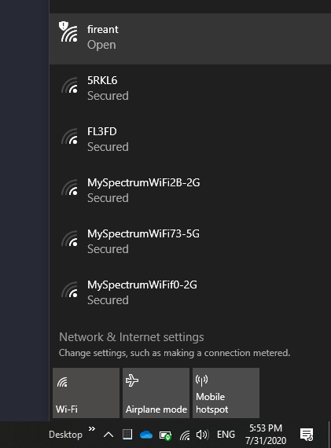

<h1 style="font-weight: bold; font-size: 250%;">Python in Small Places - Intro to IoT With MicroPython</h1>


# The "I" in IoT - Getting Onto the Internet

The killer feature of ESP8266 and ESP32 boards is the built-in TCP/IP and WIFI stack.  It is hard-wired into the chip, so regardless of whether you use C/C++, Lua, or MicroPython to program these devices, networking is the same, braindead easy process! This, and the fact that they are super cheap, is why these chips have been the backbone of the DIY IoT revolution since 2014.  The modules have even been used in consumer devices like smart outlets, Amazon Dash buttons, and WIFI security cameras.

How easy is it?  Let's see.


## The MicroPython network Module

The `network` module is the main interface to the networking stack (other, libraries include usocket and ussl). It lets you create a WIFI access point, connect to another WIFI network, or act as both an access point and a WIFI client at the same time! You can create a WIFI mesh network, connecting dozens of devices in a single, virtual network. There is even a technology called ESP-Now that uses the WIFI hardware (not not WIFI protocols) to create a super fast, instant-connect, peer-to-peer network of devices with bi-directional communication.  With a bit of tweaking and the right antennas, people have been able to achieve a range of over 4 kilometers with these little beasts.

Let's check it out.  Connect your board and get into the REPL, then let's poke around a bit. First, let's import the network module. 

```python
import network
```


# Creating an Access Point

I'll briefly show the access point configuration, but we'll be mostly concerned with the station mode to get our sensor data online. Create a file called wifi_access_point.py, and upload it to the board.  As we've done before, run it my importing it in the REPL.

**wifi_access_point.py**

```python
ap = network.WLAN(network.AP_IF)
print(ap.isactive())
ap.active(True)
ap.config(essid='fireant', password='meatmeat')

while not ap.active():
    pass

print(ap.ifconfig())
```

You should see the following output:

```
('192.168.4.1', '255.255.255.0', '192.168.4.1', '0.0.0.0')
```

We got an IP address of 192.168.4.1!  Now, if you look at the list of available networks, you should see our "fireant" network.



To disable the network:

```python
ap.active(False)
```


Well, that was super easy!  We can have a tiny network up and running in a less than a second.  It's not very useful the way it is, because we're not yet serving anything off of our device.  But it is very easy to use standard Python to set up a socket server to listen for incoming connections.  Creating your own access point like this is also the preferred way to do IoT - have the devices talk to a completely separate network from your real WIFI network, with one of the nodes acting as a bridge to the internal network if you need data going out to the Internet or to a server at your home.


# Connecting To A WIFI Network

Let's now connect to our regular network, since we'll eventually want to send our sensor data out to the cloud. It's just as easy as creating an access point.  Let's create a file called wifi_client.py:

**wifi_client.py**

```python
import network

WIFI_SSID = '<replace with your network name>'
WIFI_PASSWORD = '<replace with your network password'

wifi = network.WLAN(network.STA_IF)
wifi.active(True)
wifi.connect(WIFI_SSID, WIFI_PASSSWORD)

while not wifi.isconnected():
    pass

print('Connected! IP address: {}'.format(wifi.ifconfig()[0]))
```

Save the file, upload to the board, then import it in the REPL. Run, you should see something like:

```
Connected! IP address: 192.168.200.11
```

Let's prove that we're connected to the Internet.  Update wifi_client.py like this:

**wifi_client.py**

```python
import network
import urequests as requests

WIFI_SSID = '<replace with your network name>'
WIFI_PASSWORD = '<replace with your network password'

wifi = network.WLAN(network.STA_IF)
wifi.active(True)
wifi.connect(WIFI_SSID, WIFI_PASSSWORD)

while not wifi.isconnected():
    pass

response = requests.get('https://httpbin.org/get')
print(response.json())
print(response.text)
```

Run it, and you should see output like this:

```
{'url': 'https://httpbin.org/get', 'headers': {'X-Amzn-Trace-Id': 'Root=1-5f24b7a6-8dab56984fd930ee8b5c37a5', 'Host': 'httpbin.org'}, 'args': {}, 'origin': '100.8.252.240'}
{
  "args": {}, 
  "headers": {
    "Host": "httpbin.org", 
    "X-Amzn-Trace-Id": "Root=1-5f24b7a6-8dab56984fd930ee8b5c37a5"
  }, 
  "origin": "100.8.***.***", 
  "url": "https://httpbin.org/get"
}
```

(I obfuscated the IP address in the "origin" field.)

Cool!  In 16 lines of code, we connected to our WIFI network and made an HTTPS request to the Internet!  Not bad!  But here's some real magic.  Disconnect your board completely, plug the USB cable back in, and get connected back up to the REPL.  Now, just enter the request code in the REPL:

```python
import urequests as requests

response = requests.get('https://httpbin.org/get')
print(response.json())
print(response.text)
```

We still get our output!  What?? But we didn't write any code to connect to the WIFI network this time! What's going on?

Remember I said that the ESP chips have the networking stack baked into the hardware? Once it gets successfully connected to a network, it also remembers the network settings by storing them in non-volatile flash memory. And as soon as it boots up again, it automatically reconnects. Pretty sweet, isn't it? One consequence of this behavior is that you can separate concerns for your solution, with network connectivity handled in the boot.py, and your code can then concentrate on its core purpose.


> **Important Note:**  There are two Python files that MicroPython treats specially - **boot.py** and **main.py**.  On startup, MicroPython first looks for a file called boot.py in the root folder.  If found, this file is executed.  You can think of boot.py as the standard startup script.  Next, it looks for a file called main.py, and if found, it will be executed. main.py is the entry point for your "production" device functionality.  Once you're ready to have the device just work on startup, either rename your main script to main.py or create a main.py that imports and runs your main code.  That way, your project will fire up and do its thing as soon as it is connected to power.


Before we move on, lets refactor things a bit to keep our credentials and other secrets out of our main scripts.  Create a file called secrets.py with the following content (with the placeholders replaced with pertinent values, of course), and upload it to your board:

**secrets.py**

```python
wifi_network   = '<YOUR NETWORK NAME>'
wifi_password  = '<YOUR NETWORK PASSWORD>'
```

Now we can change our main scripts that need network credentials to use our secrets:

```python
import network
import urequests as requests
import secrets

wifi = network.WLAN(network.STA_IF)
wifi.active(True)
wifi.connect(secrets.wifi_network, secrets.wifi_password)

. . .
```

We'll add more secrets to secrets.py as we go along.


# MQTT

When it comes to sending our sensor data from lots of devices to base stations or aggregation systems in the cloud, REST is fine and easily implemented with the `urequests` (pronounced micro-requests) module, as we just saw. But REST (and therefore, HTTP) is not ideal for these tiny devices.  [MQTT](https://mqtt.org/), on the other hand, is a very light-weight messaging protocol designed specifically for this use case.  It was initially created to enable lots of sensors on marine oil rigs to reliably transmit their telemetry, while using very little resources.

Many message broker platforms, like ActiveMQ, RabbitMQ, and HiveMQ, support the MQTT protocol. However, the [Mosquitto](https://www.mosquitto.org/) open source MQTT broker is probably the most used for IoT projects and solutions. I have a Mosquitto broker running on an old Raspberry Pi 2 B+, receiving data from various sensors. The binary is less than 2 MB. It's a highly recommended piece of software!


## Set Up an MQTT Broker

Let's install Mosquitto, since it is really small, works on Mac, WIndows, and Linux, and works really well.

Linux:

```shell
sudo apt install mosquitto mosquitto-clients
```

Mac:

```shell
brew install mosquitto
```

On Windows, download the installer from the [Mosquitto download page](https://mosquitto.org/download/), and install it.

A Raspberry Pi (especially the tiny, $10 Raspberry Pi Zero W) makes a perfect host for a Mosquitto broker.  Once it's on your network, simply install and configure a secured Mosquitto broker with this script:

**init-mosquitto.sh**

```shell
#! /bin/bash

echo "Installing Mosquitto MQTT broker..."

sudo apt install mosquitto mosquitto-clients -y

echo -n "Let's configure a user account for Mosquitto.  Enter a user name:  "
read userName

sudo mosquitto_passwd -c /etc/mosquitto/users $userName

printf "\nallow_anonymous false\npassword_file /etc/mosquitto/users\n" | sudo tee -a /etc/mosquitto/conf.d/default.conf > /dev/null

sudo service mosquitto restart

printf "\nDone.  You can add more users with:\n\tsudo mosquitto_passwd /etc/mosquitto/users <new user name>\n"

```

Alternatively, you can set up a cloud MQTT account with services like [Google Cloud IoT](https://cloud.google.com/solutions/iot), [Azure IoT](https://azure.microsoft.com/en-us/overview/iot/), or [Adafruit IO](https://io.adafruit.com/). Adafuit IO is free (with certain limits, like 30 data points per minute), but it's a great way to get something going in the cloud really quickly.


## Publish Data to MQTT Queue

Once you have your MQTT service set up (either a local Mosquitto broker or a cloud MQTT service), we can start pushing our sensor data to somewhere we can use it.  We can build on what we learned with our wifi_client.py program. First, let's modify secrets.py to add our MQTT broker information:

**secrets.py**

```python
wifi_network   = '<YOUR NETWORK NAME>'
wifi_password  = '<YOUR NETWORK PASSWORD>'

mqtt_device_id = '<your unique device name/id>'
mqtt_server = '<ip address or DHCP name of MQTT host>'
mqtt_user = '<your mqtt user name>'
mqtt_password = '<your mqtt password>'
```

If you didn't create user and password credentials for your Mosquitto broker, all you need is the mqtt_server and mqtt_device_id settings. But you really should secure your Mosquitto broker.

Now, create a new file called mqtt_client.py:

**mqtt_client.py**

```python
import network
from umqtt.robust import MQTTClient
import secrets

wifi = network.WLAN(network.STA_IF)
wifi.active(True)
wifi.connect(secrets.wifi_network, secrets.wifi_password)

while not wifi.isconnected():
    pass

# Connect to the MQTT broker
print("Connecting to Mqtt...")
mqtt_client = MQTTClient(client_id=secrets.mqtt_device_id,
                    server=secrets.mqtt_server,
                    user=secrets.mqtt_user,
                    password=secrets.mqtt_password,
                    ssl=False)
mqtt_client.connect()

mqtt_client.publish('sensors/hello', 'Hello MQTT!')
```

Before you run this program, lets start up the Mosquitto subscriber client to listen for incoming messages.  Run `mosquitto_sub` in a terminal window on the Mosquitto host:

```shell
mosquitto_sub -u <mqtt user> -P <mqtt password> -v -t 'sensors/#'
```

If your Mosquitto broker is on a different machine, you can install mosquitto-clients lcoally, then use `mosquitto_sub` to connect remotely:

```shell
mosquitto_sub -h <remote host name or ip> -u <mqtt user> -P <mqtt password> -v -t 'sensors/#'
```

The -t parameter to`mosquitto_sub` specifies the topic to which you want to subscribe.  You can specify the exact path of the topic - e.g. `sensors/hello`, since that's what we're publishing to in the code.  Or you can specify a path with wildcards.  In the example above, `sensors/#` means any topic where the root it "sensors/", regardless of how many levels deep the topic is.

When you run `mosquitto_sub`, it will just sit there waiting, and will print out any received message.

Now, let's run the mqtt_client.py program on our device. The terminal running `mosquitto_sub` will print show the following output:

```shell
sensors/hello Hello MQTT!
```


Ok!  So now we know how to get temperature and humidity readings from our sensor, connect to WIFI networks, and publish messages to an MQTT queue. Next, we'll put it all together.  


# Putting It All Together

We're going to start with the dht_sensor.py program that we created previously, and build it up into our final program. Create a new file called dht_sensor_mqtt.py, and copy the code from dht_sensor.py into it.

**dht_sensor_mqtt.py**

```python
from machine import Pin
from time import sleep
import dht


SENSOR_PIN = 5

def main():
    sensor = dht.DHT22(Pin(SENSOR_PIN))
    # sensor = dht.DHT11(Pin(SENSOR_PIN))   # <-- Use this line if you have a DHT11 sensor.

    while True:
        # Get sensor readings
        # The measure() method actually samples the temperature and humidity, and stores
        # the values internally. The values are then accessed by calling temperature()
        # and humidity().
        sensor.measure()
        temperature = sensor.temperature()
        humidity = sensor.humidity()

        # Temperature is returned in Celcius. Let's convert to Fahrenheit.
        temperatureF = int((temperature * 1.8 + 32))

        reading = {
            "temperature_F": temperatureF,
            "humidity": humidity
        }

        print(reading)

        # Wait at least 2 seconds before next reading, since the DHT sensor's measure() methos
        # can only be called once every 2 seconds.
        sleep(5)


# ----- Program starts here -----
main()

```


Let's add the networking to it.  First, let's create a new file called networkUtils.py to hold encapsulate network-related functions, like creating an access point and connecting to an existing network:

**networkUtils.py**

```python
def get_access_point():
    import network
    return network.WLAN(network.AP_IF)


def get_station():
    import network
    return network.WLAN(network.STA_IF)


def start_access_point(ap_essid, ap_password):
    ap = get_access_point()
    currentEssid = ap.config('essid')

    if not ap.active():
        ap.active(True)

    if currentEssid != ap_essid:
        ap.config(essid=ap_essid, password=ap_password)
    else:
        ap.config(password=ap_password)

    print("Configured accesspoint %s" % (ap.config('essid')))


def connect_to_network(network_name, password, hostname=None, disableAP=True):
    import time

    if disableAP:
        ap = get_access_point()

        if ap.active():
            ap.active(False)

    station = get_station()

    # Determine if station mode is active.  If it is not, enable it and
    # connect to the network
    if not station.active():
        station.active(True)

    if hostname:
        station.config(dhcp_hostname=hostname)

    if not station.isconnected() or station.config('essid') != network_name:
        station.connect(network_name, password)

        while station.isconnected():
            print('Waiting for network connection...')
            time.sleep(0.5)

```


Now, let's modify the dht_sensor_mqtt.py program to use it.  We'll also add code to connect to our MQTT broker:

**dht_sensor_mqtt.py**

```python
from machine import Pin
import time
import dht
from umqtt.robust import MQTTClient
import ujson
import secrets

SENSOR_PIN = 5
TOPIC = 'sensors/environmental'
LOCATION = 'living room'
READING_INTERVAL_SECONDS = 5

def connect():
    import networkUtils
    
    print("Connecting to network")
    networkUtils.connect_to_network(secrets.wifi_network, secrets.wifi_password, hostname=secrets.device_id)

    print("Connecting to MQTT broker")
    client = MQTTClient(client_id=secrets.mqtt_device_id,
                        server=secrets.mqtt_server,
                        user=secrets.mqtt_user,
                        password=secrets.mqtt_password,
                        ssl=False)
    client.connect()

    print("Connected")

    return client

. . .
```

We imported the `umqtt.robust.MQTTClient` module, and created a new `connect()` method.  This method ensures that we are connected to our WIFI network, then connects to the MQTT broker. The method returns a reference to the connected MQTT client.

Then we will modify the `main()` method to publish our sensor readings:

**dht_sensor_mqtt.py**

```python
. . .

def main():
    pin = Pin(SENSOR_PIN, Pin.IN, Pin.PULL_UP)
    sensor = dht.DHT22(pin)

    mqttClient = connect()

    while True:
        try:
            sensor.measure()
            temperature = round((sensor.temperature() * 1.8) + 32, 2)
            humidity = sensor.humidity()

            reading = {
                "device": secrets.mqtt_device_id,
                "location": LOCATION,
                "temperature_F": temperature,
                "humidity": humidity
            }

            print(reading)

            mqttClient.publish(TOPIC, ujson.dumps(reading), qos=0)

            # Wait at least 2 seconds before next reading, since the DHT sensor can only
            # be read once every 2 seconds
            time.sleep(READING_INTERVAL_SECONDS)
        except KeyboardInterrupt:
            print('Bye')
            mqttClient.disconnect()
            break
        except OSError:
            mqttClient = connect()
```

That should do it.  The entire program should look like this:

**dht_sensor_mqtt.py**

```python
from machine import Pin
import time
import dht
from umqtt.robust import MQTTClient
import ujson
import secrets


SENSOR_PIN = 5  # Change SENSOR_PIN to match the actual pin the sensor is connected to
TOPIC = 'sensors/environmental'
LOCATION = 'living room'  # Change to describe your device location
READING_INTERVAL_SECONDS = 5


def connect():
    import networkUtils
    print("Connecting to network")
    networkUtils.connect_to_network(secrets.wifi_network, secrets.wifi_password, hostname=secrets.mqtt_device_id)

    print("Connecting to MQTT broker")
    client = MQTTClient(client_id=secrets.mqtt_device_id,
                        server=secrets.mqtt_server,
                        user=secrets.mqtt_user,
                        password=secrets.mqtt_password,
                        ssl=False)
    client.connect()

    print("Connected")

    return client


def main():
    pin = Pin(SENSOR_PIN, Pin.IN, Pin.PULL_UP)
    sensor = dht.DHT22(pin)

    mqttClient = connect()

    while True:
        try:
            sensor.measure()
            temperature = round((sensor.temperature() * 1.8) + 32, 2)
            humidity = sensor.humidity()

            reading = {
                "device": secrets.mqtt_device_id,
                "location": LOCATION,
                "temperature_F": temperature,
                "humidity": humidity
            }

            print(reading)

            mqttClient.publish(TOPIC, ujson.dumps(reading), qos=0)

            # Wait at least 2 seconds before next reading, since the DHT sensor can only
            # be read once every 2 seconds
            time.sleep(READING_INTERVAL_SECONDS)
        except KeyboardInterrupt:
            print('Bye')
            mqttClient.disconnect()
            break
        except OSError:
            mqttClient = connect()


# ------- Main program execution starts here --------
main()

```

Upload the modified secrets.py, networkUtils.py, and dht_sensor_mqtt.py to your board.  Before we run the final solution, fire up your MQTT listener again so we can see incoming messages:

```shell
mosquitto_sub -h <remote host name or ip> -u <mqtt user> -P <mqtt password> -v -t 'sensors/#'
```

Go into the REPL and import the program to run it:

```python
>>> import dht_sensor_mqtt
```

We should see output like this in the REPL:

```
Connecting to network
Connecting to MQTT broker
('192.168.1.169', 1883)
Connected
{'location': 'living room', 'device': 'dalexis-sensor-5790ed00', 'temperature_F': 83.3, 'humidity': 40.5}
{'location': 'living room', 'device': 'dalexis-sensor-5790ed00', 'temperature_F': 83.48, 'humidity': 40.2}
{'location': 'living room', 'device': 'dalexis-sensor-5790ed00', 'temperature_F': 83.48, 'humidity': 40.2}
{'location': 'living room', 'device': 'dalexis-sensor-5790ed00', 'temperature_F': 83.48, 'humidity': 40.1}
```

And in the terminal where you ran mosquitto_sub, you should see something like this:

```
sensors/environmental {'location': 'living room', 'device': 'dalexis-sensor-5790ed00', 'temperature_F': 83.3, 'humidity': 40.5}
sensors/environmental {'location': 'living room', 'device': 'dalexis-sensor-5790ed00', 'temperature_F': 83.48, 'humidity': 40.2}
sensors/environmental {'location': 'living room', 'device': 'dalexis-sensor-5790ed00', 'temperature_F': 83.48, 'humidity': 40.2}
sensors/environmental {'location': 'living room', 'device': 'dalexis-sensor-5790ed00', 'temperature_F': 83.48, 'humidity': 40.1}
```


# Conclusion

We learned how to:

- Download and install MicroPython to ESP8266 and ESP32 boards
- Understand the map of boards and components with pinout diagrams
- Interact with MicroPython in the REPL, and uploading and running Python files
- Create a `main.py` file to run our code on startup
- Get readings from a temperature/humidity sensor
- Create an access point
- Connect to a WIFI network
- Connect to an MQTT broker and send/receive messages
- And finally, publish sensor readings to a queue on an MQTT broker

You should be ready now to dig deeper into the world of MicroPython and IoT!  Happy Coding!


----

> **Interesting:** We always see pictures of pythons in anything related to Python. But Python was named, not after a snake, but after Monty Python! Hence I end this document with what I think should be the real Python logo - the iconic image of John Cleese from the Ministry of Silly Walks skit.

