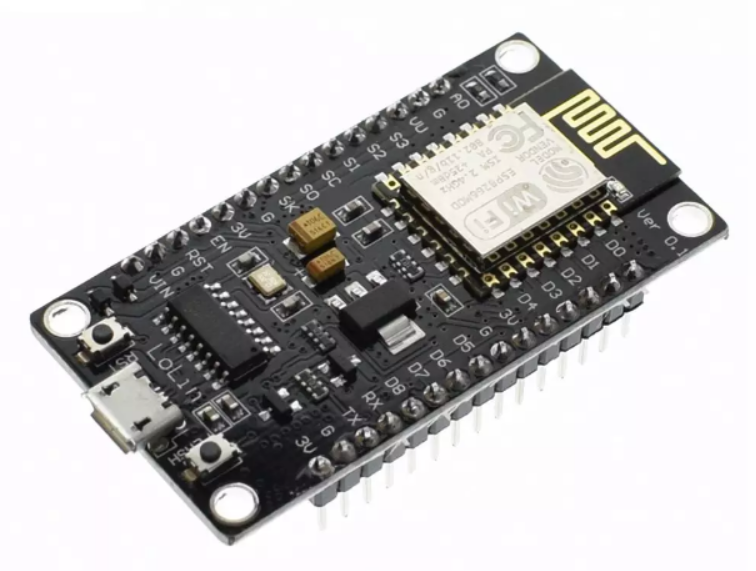
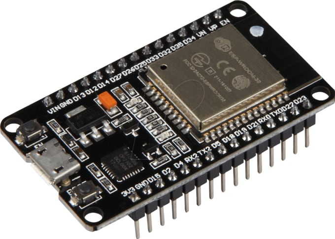
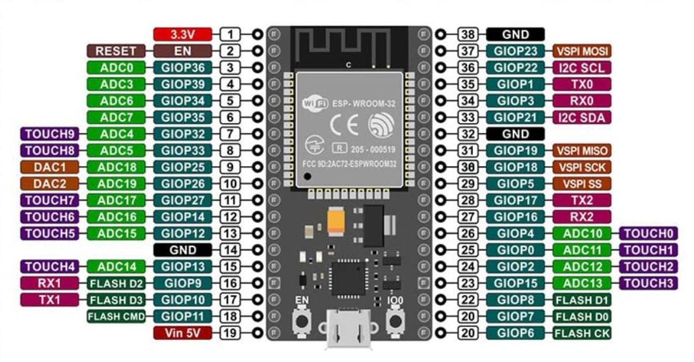
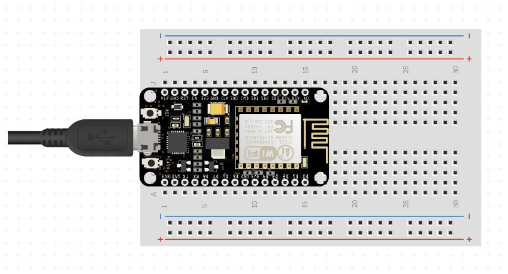

<h1 style="font-weight: bold; font-size: 250%;">Python in Small Places - Intro to IoT With MicroPython</h1>


[TOC]

# Introduction to MicroPython

Developing for microcontrollers was previously the domain of electrical engineers who used assembler and/or C/C++ with complicated toolchains and lengthy build processes. This changed radically with the introduction of Adruino, which radically simplified the coding and build process, and the provided a platform that made DIY electronics and prototyping accessible to a much wider audience. But you still had to learn to program in C/C++, which, while not terribly difficult, still presented a barrier for entry.

Python is one of the most popular languages, for good reason. It is clean and powerful, allowing developers to be very productive. Programmers get immediate feedback to their changes without having to wait for the code to compile and deploy. Need to quickly check if something would work as expected? Jump into the REPL, execute a few commands, and see their results immediately. What if you can have the power and simplicity of the Arduino platform, but with the rapid feedback loop and productivity of Python?

This is what MicroPython provides. In this course, we're going to learn about MicroPython, how to install it on Internet of Things (IoT) devices, see various development environment options, and build a working IoT application that transmits sensor readings over WiFi.

Let's get started!


# Know Your Board

There are two types of microcontroller boards that we'll talk about.

## ESP8266-based boards

The ESP8266 is the chip that arguably started the do-it-yourself (DIY) IoT revolution, and was created by Espressif, a company based in Shanghai, China.  It contains a 32-bit processor running at 80MHz, with 64K of RAM and 4MB flash storage.  That's 5 times the processing power, 16 times the RAM, and 128 times the storage of a typical Arduino board.  But the killer feature is a built-in WiFi stack that can act as a WiFi client, access point, or both at the same time!  These boards can be obtained for as little as $4 in the US and under $1 from China. The ESP8266 was initially marketed as an add-on WiFi component for other microcontrollers, like Arduino.  Then someone realized that it contained its own microcontroller CPU that was much more powerful than the Arduinos it was augmenting.  The open source community built the necessary libraries to make it Arduino-compatible, and its popularity exploded almost overnight.




## ESP32-based boards

Following on the success of the ESP8266, Espressif came up with the ESP32.  This has a dual-core 32-bit processor running at between 160MHz and 240MHz, a 3rd ultra-low-power co-processor, faster WiFi, Bluetooth, and lots more I/O ports.  In addition to the standard "developer board" form factors, this chip comes in interesting packages like the ESP Cam (a 2MP camera for video streaming and still imaging for about $8) and the ESP-AI (camera plus built-in face-detecting AI in hardware).




## Pinouts

One important term you will come across often is "pinout".  A pinout is a visual map of a board or component.  Having a pinout diagram of your board (and/or whatever component you're trying to work with) handy saves lots of time and frustration.  When you're trying to hook up your temperature sensor, for instance, it's very important to know which pin connects to the power and which connects to ground, otherwise it won't work (at best) or there will be fireworks (at worst).

These diagrams are readily available on the Internet, and can be obtained by searching for "pinout" plus whatever board or component you're interested in.  For example, the following diagram of a typical ESP8266 development board can be found by Googling, `esp8266 pinout`.  If you have an ESP32 board, search for `esp32 pinout`.

#### ESP8266 Pinout


#### ESP32 Pinout




There are a few things to take note of on this diagram:

- The pin labels printed on the board itself are different from the callout labels that say, "GPIO<number>".  If you're working with the Arduino development environment, there are sometimes constants defined for given boards, where you can reference pins in your code as `D5` or `A1`.  The "GPIO" (General Purpose Input/Output) pin numbers are the actual pin numbers of the underlying microcontroller chip, and in the case of ESP8266 and ESP32 boards, the pin labels on the board do not match the GPIO pin numbers.  `¯\_(ツ)_/¯`.
- In MicroPython, the GPIO labels are the ones you need to take note of and reference in your code.
- There are a number of different color coded labels for some pins.  Those pins serve special purposes, sometimes multiple purposes.  For example, the green labels represent the connections to use for SPI (serial peripheral interface) components.  The orange labels are for I2C (inter-integrated circuit) connections.  The blue labels are for basic transmit/receive connections.  The purple label shows the single analog/digital I/O pin on the ESP8266.  The ESP32 has 18 such pins for analog I/O, as well as a few pins for digital to analog conversions.

Find the pinout diagram for your particular board, and keep it handy.  Note:  AdaFruit's boards have a very different layout, but it seems that many board makers are catching on to their "feather" board design.

The ESP boards work on 3.3 volts. This is important for two main reasons.  The board will get damaged if you feed it any more than 3.3V on any of the pins labeled `3.3V`.  Batteries or other power supplies ranging from 5V to 12V can be supplied to the `Vin` (voltage in) pin, although it is not advised to go over 9 volts. (I once connected a 9 volt supply to Vin on a cheap ESP8266, and it exploded.) The other importance of the 3.3 volts is that these boards will only work with components designed for up to3.3V.  Make sure that any components you try to use are not 5V-rated.  Some components, like the DHT sensor we will use, work with anything from 2 to 5 volts, so they work perfectly with ESP boards.


# Working With a Breadboard




One of the most important tools in the electronics prototyping toolbox is the breadboard. It is used to build circuits and connect components in a non-permanent way. Once you’ve built and tested the circuit, you can then move on to soldering it in a more permanent, and more compact, way on perfboard or a specially designed printed circuit board (PCB).

A breadboard is like a pin cushion for connecting things, with a grid of holes that are connected electrically. There are two parts to a breadboard - the main area consisting of groups of **terminal strips** where components are inserted and arranged, and the **power rails** along the top and bottom.

Here we see how a breadboard is connected internally.


The main area consists of a two separate grids of holes arranged in usually 30 or more columns (labeled 1 through 30) of 5 holes (labeled a through e, and f through j), separated by a groove. Each column of 5 holes is called a terminal strip. All of the 5 holes (or **tie points**) in a column are connected together internally.

The power rails are along the top and bottom of the breadboard, and each consists of two strips of tie points. The power strip (+ve voltage) is marked with a **+** and a red line. The ground rail is marked with a **-** and a line that is either black or blue.

Power and ground are typically fed to the breadboard from the 5V (or 3.3V) and GND pins on a microcontroller board (like an Arduino or ESP8266), and the strips are then used to feed power and ground to components of your circuit. We’ll see this in action later.


# Tool and Development Environment Setup

The tools that we are going to use are Python-based, so we're going to set up a Python virtual environment to hold them.

Create a folder somewhere to hold our virtual environment and MicroPython projects.  For example, I have my code set up under C:\code\iot on my Windows machine and ~/code/iot on my Linux environment.  Create your own based on your preference, but for this document, let's assume ~/code/iot.

First, let's go to that folder and create a new virtual environment.

```shell
cd ~/code/iot
python3 -m venv iotenv
```

These commands will work just as shown in Powershell for Windows, except you would call Python with `python` or `py` instead of `python3`.

Let's activate the virtual environment.

```shell
source iotenv/bin/activate
```

In Windows Powershell:

```shell
./iotenv/scripts/activate.ps1
```

Now we will install a few tools that we'll use.  Esptool is used to flash MicroPython onto our board.

```shell
pip install esptool
esptool.py version
```

Note that once installed, esptool must be called with the .py extension:  `esptool.py`.  Run it with no arguments to get help on its various commands.

Now let's install a few other tools that we'll walk through in more detail later.

```shell
pip install rshell
pip install adafruit-ampy
pip install mpfshell
```

- **rshell:**  Remote Shell for Micropython.  This lets you connect to your board, then presents what looks like a basic Linux-type shell that lets you copy files to and from the board, and the ability to launch a Python REPL on the board.
- **Adafruit ampy:**  AdaFruit's MicroPython Tool.  This is a CLI tool - ampy - for copying files to and from your board, and to have very basic control over the board.  Ampy has fallen behind somewhat, and was even going to be discontinued by Adafruit, but it lives on. Adafruit tends to concentrate more on CircuitPython, their MicroPython fork.
- **mpfshell:** MicroPython File Shell.  This is very similar to rshell, but does not use the somewhat confusing fake Linux user interface paradigm.  One cool advantage it has is the ability to pre-compile your code to byte code, which will save time and memory when the code executes on the device.

You don't need all three of these tools, but it's good to explore them all so you can see which one fits your preferences.


## IDE Choices

Since you don't have to worry about a compiler toolchain, you basically can choose any development environment that you like.  The differences between them come down to the the workflow of getting your Python files onto your board.  I have explored a number of options to try to provide information that is as objective as possible.

### Thonny

[Thonny](https://thonny.org/) is a simple Python IDE designed for beginners on devices like Raspberry Pi, and for working with MicroPython devices.  It doesn't have all the bells and whistles as a typical IDE, but where it shines is that it has the best integration with MicroPython devices.  Thonny works on Mac, Windows, and Linux.

### Visual Studio Code

VS Code is my IDE of choice, partly because of its extensibility through open source extensions.  Sadly, the MicroPython prospects range from barely OK to really bad.  So while VS Code would be great at editing your MicroPython code, you'll need to use other tools, like rshell, in conjunction.

### Atom

There is a plugin called Pymakr for both VS Code and Atom.  But while the VS Code version seems barely even workable, the Atom version works surprisingly well. It provides a UI within Atom that let's you connect to one or more boards, use the Python REPL on the board, run a particular Python file, reboot your board, and sync your "project" with the board.  The sync option copies the entire folder tree open in Atom to the board!  This burned me the first time, until I figured out how to select which folder gets synced and how to exclude files.  Atom + Pymakr is not perfect, but it's very workable.

### PyCharm

Lots of Python developers use PyCharm.  And it has a MicroPython plugin that supposedly works really well.  I couldn't get it to work.  This is not necessarily anything to do with PyCharm or the plugin, but more to do with my brain just not being in sync with most things from Jetbrains.

### vim, etc.

I'm not a vi person, but I would wager that someone out there has created the perfect vi plugin for MicroPython. Even without that, though, there are some wonderful command line tools - like rshell - for working with MicroPython boards.

### Your Editor of Choice + Command Line Tools

I find myself using this option mostly.  I would play around with code snippets in Thonny, since it works so seamlessly with the board.  But once I'm ready to work the code into a piece of art, I'll switch to VS Code or Atom and use rshell or mpfshell to shuttle code to and from the device from the command line.


# MicroPython Installation

If you've worked with Arduino development, you know the compile/upload/run cycle well.  Your project code must first be compiled to a binary machine code targeted for a particular board.  The binary must then be flashed onto the board, and the board is reset.  Only then will you see whether the code worked. There's usually a lot of waiting around, which it typical when working with C/C++.

MicroPython is very different.  The MicroPython environment (compiler/interpreter) is the only thing that needs to get flashed to your board, and this is done only once.  From then on, you run code on the board simply by uploading changed .py files to the board and running them.  Need to see how a particular snippet of code behaves?  Launch the Python REPL on the board, and just start typing Python!  Too much to type? Put the REPL into paste mode, paste your code, and it runs. This is an exciting level of productivity for the microcontroller world.

Let's get Python onto that board!  The full details about the installation can be read on the [Quick Reference](http://docs.micropython.org/en/latest/index.html) page for your particular board on the MicroPython site.

First, we need to download the latest stable build of MicroPython for our board.  Go to the [download page](http://micropython.org/download/) and click on the link for your board.  If you have an ESP8266 board, click the [Generic ESP8266 board](http://micropython.org/download/esp8266) link.  If you have an ESP32 board, click on the [Generic ESP32 board](http://micropython.org/download/esp32) link.  Download the latest stable build.  As of this writing, that was [esp8266-20191220-v1.12.bin](http://micropython.org/resources/firmware/esp8266-20191220-v1.12.bin) for ESP8266 and [esp32-idf3-20191220-v1.12.bin](http://micropython.org/resources/firmware/esp32-idf3-20191220-v1.12.bin) for ESP32.  Once downloaded, copy/move the file to the `~/code/iot` folder (or whatever folder you created in the "Tool and Development Environment Setup" section above).

Now, connect your board and determine what port it is connected to.  On Windows, this will be a COM port, and on Mac and Linux, it will appear as a folder under the `/dev` folder.  We can use the rshell tool we previously installed to get this information:

```shell
rshell --list
```

You might see something like the following

on Mac:

```
USB Serial Device 10c4:ea60 with vendor 'Silicon Labs' serial '0001' found @/dev/cu.SLAB_USBtoUART
```

or on Windows:

```
USB Serial Device 10c4:ea60 with vendor 'Silicon Labs' serial '0001' found @COM9
```

or on Linux:

```
USB Serial Device 10c4:ea60 with vendor 'Silicon Labs' serial '0001' found @/dev/ttyUSB0
```

What you want to look for is the entry with "vendor 'Silicon Labs'". Take note of the port after the "@".

First, we need to erase anything that is currently on the board.  You will also need to do this if you ever want to re-install MicroPython onto a board (e.g. installing a new version).  This is done using esptool:

```shell
esptool.py --port <port> erase_flash
```

Replace `<port>` with the actual port your device is connected to.  For example, let's say we're on Linux and the board is connected to `/dev/ttyUSB0`.  The command would be:

```shell
esptool.py --port /dev/ttyUSB0 erase_flash
```


Once the command completes, the board will have nothing on it, and we can go ahead and install (flash) the actual MicroPython binary onto it.  There is no operating system involved.  The Python environment will be running on the "bare metal" of the board and acting as interpreter, compiler, and operating system.  The command to install it may be different for each type of board, and if definitely different for the ESP8266 and ESP32.  Be sure to use the right one.


To flash MicroPython to an **ESP8266** device:

```shell
esptool.py --port /dev/ttyUSB0 --baud 460800 write_flash --flash_size=detect 0 esp8266-20191220-v1.12.bin
```


To flash MicroPython to an **ESP32** device:

```shell
esptool.py --port /dev/ttyUSB0 --baud 460800 write_flash --chip esp32 -z 0x1000 esp32-idf3-20191220-v1.12.bin
```


Assuming the command completed successfully, your board is now rocking Python!  Let's check it out using the REPL. Let's use rshell for this.  Back in your terminal with our IoT Python virtual environment activated, type `rshell`. You should see something like the following:

```
Welcome to rshell. Use Control-D (or the exit command) to exit rshell.

No MicroPython boards connected - use the connect command to add one

/home/dalexis/code/iot>
```


Now we're going to use the port that our board is connected to in the next command.  On Windows this might be something like `COM9`, on Mac `/dev/cu.SLAB_USBtoUART`, and on Linux maybe `/dev/ttyUSB0`.  I'm using a Windows machine with Ubuntu 20.04 bash as my default terminal environment, and my board is connected on COM9.  So I can use either COM9 (from Powershell), or /dev/ttyS9 under WSL/Ubuntu.  At the rshell prompt, let's use the `connect serial <port>` command. In my case, under WSL it would be:

```shell
/home/dalexis/code/iot> connect serial /dev/ttyS9
```

And I see the following output:

```
Connecting to /dev/ttyS9 (buffer-size 512)...
Trying to connect to REPL  connected
Testing if sys.stdin.buffer exists ... Y
Retrieving root directories ... /boot.py/
Setting time ... Jul 29, 2020 22:20:45
Evaluating board_name ... pyboard
Retrieving time epoch ... Jan 01, 2000
/home/dalexis/code/iot>
```


As you can see, it's letting me know that it was able to connect to the board and set it's time to my current machine time.  Note that rshell can trip you up a bit, since the prompt looks like your OS prompt.  But it's not.  It's within rshell, and displaying your current folder in the prompt.  It even let's you do Linux-type commands like ls, cp, rm, mkdir, and cd. It exposes the filesystem on your board (yes, there is a filesystem on that tiny thing!) under the path `/pyboard`.  Let's try the following:

```
/home/dalexis/code/iot> ls /pyboard
```


You should see a listing for boot.py, which comes by default with a MicroPython installation.  Check out the various available rshell commands by typing `help`.

And now for something completely different! (Obligatory Monty Python reference there.  Sorry.)  At the rshell prompt, type `repl`.  You should see something like:

```
Entering REPL. Use Control-X to exit.
>
MicroPython v1.12 on 2019-12-20; ESP module with ESP8266
Type "help()" for more information.
>>>
>>>
```

Now we can do the obligatory Hello World program:

```python
>>> print('Hello micro World!!')
Hello micro World!!
>>>
```

But to be truly idiomatic, the real microcontroller Hello World program is referred to by some as Blinkenlights, a term ripe with [tech shenanigan history](https://en.wikipedia.org/wiki/Blinkenlights).  Luckily, these boards have a couple built-in LEDs, so they are ready for das blinkenlights! Try the following:

```python
>>> from machine import Pin
>>> from time import sleep
>>> led = Pin(2, Pin.OUT)
>>> while True:
...     led.value(not led.value())
...     sleep(.5)
...
```

Or alternatively (not going to show the REPL prompts from now on.  You're a Pythonista.  You know what's up):

```python
from machine import Pin
from time import sleep

led = Pin(2, Pin.OUT)

while True:
    led.on()
    sleep(.5)
    led.off()
    sleep(.5)
```

This will just go on forever until you reset the board or hit Ctrl-C.

You'll notice that as soon as you run the `led = Pin(2, Pin.OUT)` line, the LED comes on.  And if you do `led.on()` it goes off.  Weird.  This is a fun little quirk with the built-in LEDs on ESP8266 boards, and due to them being internally connected to what's called a pull-up resistor.  The TL;DR about a pullup resistor is that it makes it so that off is on and on is off. Weird. But it has its uses.  The good thing is that the LED on my ESP32 boards behave normally.  I'm assuming that they got enough complaints from confused ESP8266 users that they "fixed" it with the ESP32.


In the [next section](section_2.md), we'll get to know the "Thing" part of IoT with MicroPython.
