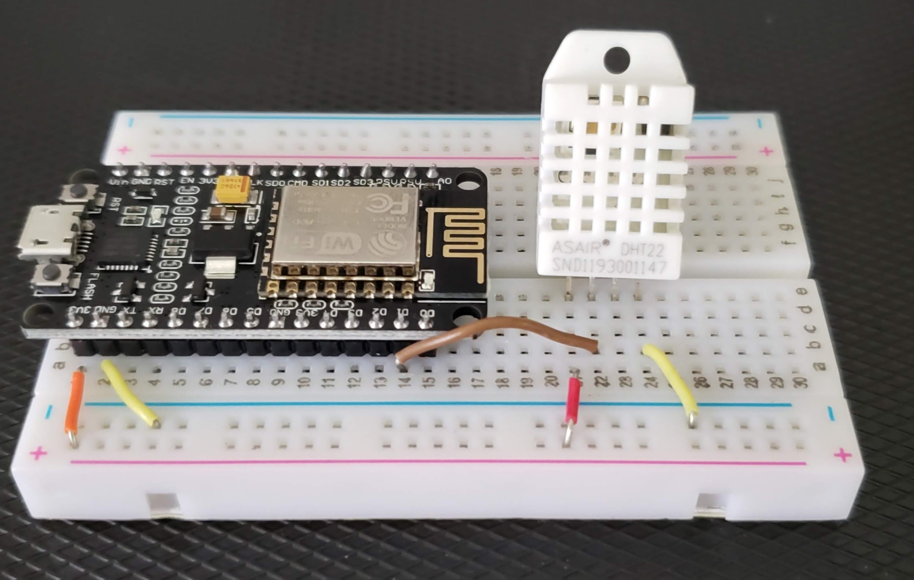
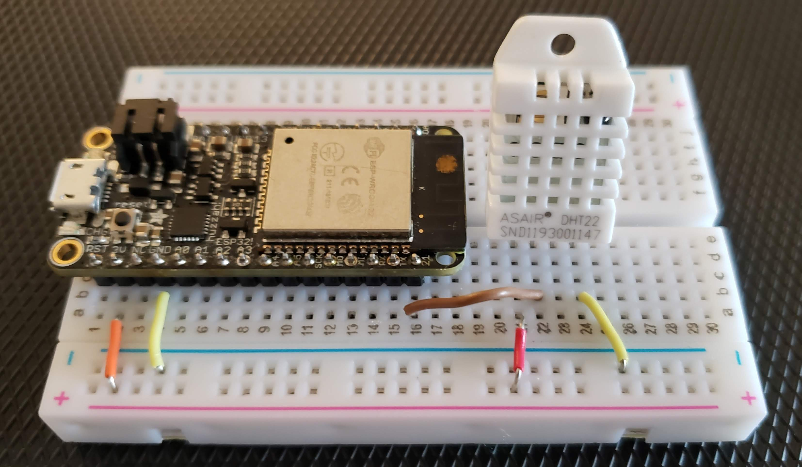

<h1 style="font-weight: bold; font-size: 250%;">Python in Small Places - Intro to IoT With MicroPython</h1>


[TOC]

# Hello World, Again


In Section 1, we tested our board with the iconic microcontroller Hello World program:

```python
import machine
import time

led = machine.Pin(2, machine.Pin.OUT)

# We need an infinite loop in our program so that the device keeps performing our
# desired functionality until it gets turned off or reset.
while True:
    # led.value() gives us the current state of the pin (On or Off / True or False).
    # With every pass through our loop, we will set the state of the LED to the
    # opposite of its current state.
    led.value(not led.value())

    # Do nothing for half a second before going on.
    # The effect of this is that the LED will go on for 1/2 a second, go off for
    # 1/2 a second, then go on for.....  You get the idea.
    time.sleep(.5)

```

Let's break this down to see what's going on.

```python
import machine
```

The '**machine**' module contains classes and methods for accessing device-specific functionality, like the general-purpose I/O (GPIO) pins.

> **GPIO:** Microcontroller chips interact with the external world though wires that expose things like analog I/O, digital I/O, interrupt signals, or clock signals.  These are called *pins*, and the set of these pins that can be used by software to do useful things are the termed general purpose I/O pins.  We'll be able to use these GPIO pins to read measurements from sensors or tell an LED to turn on or off.

You can check out the properties, methods, and classes of the machine module by typing `help(machine)` in the REPL after the module has been imported.

We will use the Pin class from the machine module.  The Pin class lets us declare how we would like to use a particular pin.

```python
led = machine.Pin(2, machine.Pin.OUT)
```

On this line, we're creating an instance of the Pin class (led) that hooks up to GPIO pin 2.  Both ESP8266 and ESP32 boards have a built-in LED on the board that is internally connected to GPIO pin 2. Most ESP8266 boards also have another LED on pin 16. The second parameter to the Pin constructor - machine.Pin.OUT - is a constant that says that we want to use the pin as an output.

We'll be sending a signal to the pin that represents a HIGH signal (3.3v) or LOW signal (0 volts).

```python
led.value(not led.value())
```

This simply flips the current state of the LED pin.  `led.value()` returns either 0 or 1, indicating off or on respectively.  Calling the function without a value returns the current state.  Calling it with either a 1 or 0 (or True or False) sets the state.

Finally:

```python
time.sleep(.5)
```

This tells the board to delay your program for a specified number of seconds (half a second, in this case) before continuing to the next line.  If .5 seconds seems a llittle weird and you would prefer to specify 500 milliseconds, you can do this by calling the `time.sleep_ms()` function instead:

```
time.sleep_ms(500)
```

Here's an alternate version of the program that uses the on() and off() methods and time.sleep_ms():

```python
from machine import Pin
import time

led1 = Pin(2, Pin.OUT)

while True:
    led1.on()
    time.sleep_ms(500)
    led1.off()
    time.sleep_ms(500)
```

Let's use the REPL's "paste" mode to quickly enter this program.  Copy the code from this document, then press `Ctrl-E` in the REPL.  This enters "paste" mode.  Paste the program the right mouse button or `Cmd-V` on a Mac or 'Shift-Ctrl-V' on a PC.  Hit enter to ensure that we have a blank line at the end, then press `Ctrl-D`.  This exits "paste" mode and runs the program.  Hit `Ctrl-C` to stop the program.


So now that we know about GPIO pins and how to get around the REPL, let's move on to working with our digital temperature/humidity sensor


# The "Thing" in IoT - Temperature Sensor


## Sensor Pinout


If your sensor has only three pins, the pin labeled `+` is VCC, `-` is GND, and `out` is Data.


Insert the sensor into the breadboard as shown below.  It doesn't matter where, as long as it is connected across the breadboard columns and not down one column.  The key thing to note is the pinout of the sensor and where each pin needs to ultimately be connected to the board.




**ESP8266 - DHT11/22 Wiring**

|                    | ESP8266                   | Breadboard     | DHT Sensor       |
| ------------------ | ------------------------- | -------------- | ---------------- |
| 3.3V power         | 3.3V pin                  | +ve power rail |                  |
| Ground             | GND pin                   | -ve power rail |                  |
| Sensor power       |                           | +ve power rail | VCC pin (pin 1)  |
| Sensor ground      |                           | -ve power rail | GND pin (pin 4)  |
| Sendor data signal | GPIO5 (D1 on the ESP8266) |                | Data pin (pin 2) |

If you have a different board, like an ESP32 or an Adafruit Huzzah board, the locations of the pins and the pin used for data will be different.  Here we see what the hookup looks like with an Adafruit Huzzah32 board. Note the positions of the 3.3V and GND pins, and that we're connecting the sensor's data pin to pin 21 on the board. GPIO5 on the Huzzah32 is labeled as SCK.




Ok, let's get sensing!  First, some basic imports for the modules we need.

```python
from machine import Pin
from time import sleep
import dht

SENSOR_PIN = 5
```

You already know the `machine` and `time` modules.  The last one - `dht` - is the star of this show.  It is a built-in module in MicroPython that encapsulates the code necessary to interact with DHT11 and DHT22 sensors.  Now we need to get an instance of either the DHT11 class or the DHT22 class, depending on which sensor you have.  The DHT11 is typically blue, while the DHT22 is white and usually a bit larger.  The pinouts for both sensors are the same - 4 pins (power, data, an unused pin, and ground).  In the code above, we also set up a constant representing the pin we're going to use to read sensor data.

```python
sensor_pin = Pin(SENSOR_PIN, Pin.IN, Pin.PULL_UP)
sensor = dht.DHT22(sensor_pin)
```

Of course, we could condense this into:

```python
sensor = dht.DHT22(Pin(SENSOR_PIN, Pin.IN, Pin.PULL_UP))
```

Basically, we need to get an instance of Pin that is properly configured as an input.  The `Pin.PULL_UP` parameters tells the board to activate the internal pull up resistor.  This is because the DHT sensors expect the data pin to be pulled high. i.e. that the normal state should be "on" or full voltage.

Now, let's get a reading.

```python
sensor.measure()
temperature = sensor.temperature()
humidity = sensor.humidity()
print(temperature, humidity)
```

You should see output like this:

```
27.7 44.1
```

So, what's going on here?  DHT sensors can only measure temperature and humidity once every 2 seconds.  But you may end up getting the temperature and/or humidity reading multiple times in a second (e.g. if your code keeps calling `sensor.temperature()` on different lines). To accommodate this, the sensor breaks up the functionality. The `measure()` method does the actual work of reading the sensors, and sets that state internally.  Then the `temperature()` and `humidity()` methods (which are actually more like properties) can be called as many times are you need to get the readings.

The 27.7 in the output is the temperature in Celsius (because only barbarians still use Fahrenheit), and the 44.1 is the humidity percentage. It's a bit toasty in here, I guess.  Since I'm a barbarian, let's see how much that is in barbarian units:

```python
>>> print(sensor.temperature() * 1.8 + 32)
81.86
```

81.86 F is not bad by this barbarian's standards, but paired with the 44.1% humidity, it's a bit muggy in here.

Let's put it all together in a program. Create a file called dht_sensor.py:

**dht_sensor.py**

```python
from machine import Pin
from time import sleep
import dht


SENSOR_PIN = 5

def main():
    sensor = dht.DHT22(Pin(SENSOR_PIN))
    # sensor = dht.DHT11(Pin(SENSOR_PIN))   # <-- Use this line if you have a DHT11 sensor.

    while True:
        # Get sensor readings
        # The measure() method actually samples the temperature and humidity, and stores
        # the values internally. The values are then accessed by calling temperature()
        # and humidity().
        sensor.measure()
        temperature = sensor.temperature()
        humidity = sensor.humidity()

        # Temperature is returned in Celcius. Let's convert to Fahrenheit.
        temperatureF = int((temperature * 1.8 + 32))

        reading = {
            "temperature_F": temperatureF,
            "humidity": humidity
        }

        print(reading)

        # Wait at least 2 seconds before next reading, since the DHT sensor's measure() method
        # can only be called once every 2 seconds.
        sleep(5)

# ----- Program starts here -----

main()

```


## Uploading The Code to Our Board

### rshell

This is getting a little too long to type in the REPL.  You can use whichever editor you like, and save the file in the IoT code folder we created before.  In the companion code repo, the code for this program is under src/02-sensors/dht_sensor.py.  That's the location I'll assume in the next bit.

So we have the code in a file.  We can use rshell to copy it to our board.  In a terminal, make sure that your IoT Python virtual environment is activated and that you're.  Then run rshell.  Once you're at the rshell prompt, connect to the board using the `connect serial <port>` command:

```shell
/home/dalexis/code/iot> connect serial /dev/ttyS9
```

Then, assuming again that the code is in 02-sensors/dht_sensor.py, I can copy it to the board like this:

```shell
/home/dalexis/code/iot> cp 02-sensors/dht_sensor.py /pyboard/
```

Remember that rshell makes the board's file system available under the virtual /pyboard folder.  We can verify that the file is uploaded to the board:

```shell
/home/dalexis/code/iot> ls /pyboard
```

We should see output like this, showing that the file is indeed on the board:

```shell
boot.py      dht_sensor.py
```

Now, let's run it.  Still in rshell, type `repl`, which will launch the Python REPL on the board.  Once the REPL is up, we can run our code by importing the file:

```python
>>> import dht_sensor
{'temperature_F': 83, 'humidity': 44.60001}
{'temperature_F': 83, 'humidity': 44.7}
{'temperature_F': 83, 'humidity': 44.7}
{'temperature_F': 83, 'humidity': 44.7}
```

We should see temperature and humidity output every 5 seconds!


### mpfshell

Let's try the same thing with mpfshell.  Run mpfshell, and you will get the following prompt:

```shell
mpfs [/]>
```

You can type `help` to see the various commands it offers.

Let's connect to our board, copy the code to it, run the REPL, and execute the code:

```
mpfs [/]> open ttyS9
Connected to esp32
mpfs [/]> put 02-sensors/dht_sensor.py /dht_sensor.py
mpfs [/]> repl
>
*** Exit REPL with Ctrl+Q ***

MicroPython v1.12 on 2019-12-20; ESP32 module with ESP32
Type "help()" for more information.
>>> import dht_sensor
{'temperature_F': 83, 'humidity': 44.7}
{'temperature_F': 83, 'humidity': 45.2}
{'temperature_F': 83, 'humidity': 45.2}
{'temperature_F': 83, 'humidity': 45.1}
```

The `open <port>` command connects to the board on a given port.  Notice that we don't need to specify the `/dev/` prefix to the port name (for Mac and Linux).  On Windows, the command is the same, but with a Windows port.  e.g. `open COM9`.

Then we use the `put` command to copy `02-sensors/dht_sensor.py` to the root folder of the board (/dht_sensor.py).

After that, the `repl` command and executing our code is the same as with rshell.


Great!  So we now know how to get MicroPython onto our board, how to use a pinout diagram as the map to boards and components, how to hook things up on a breadboard, and get temperature and humidity readings in MicroPython.  The DHT sensors are simple to work with, since they require only a single pin (other than the requisite power and ground).  Other sensors and devices, like the BME280 temperature/humidity/barometric pressure sensor and very cute SSD1306 OLED screens, interface with our board through communication busses or protocols like I2C or SPI.


---

Next, we'll figure out the ["Internet" part](section_3.md) of IoT with MicroPython.
